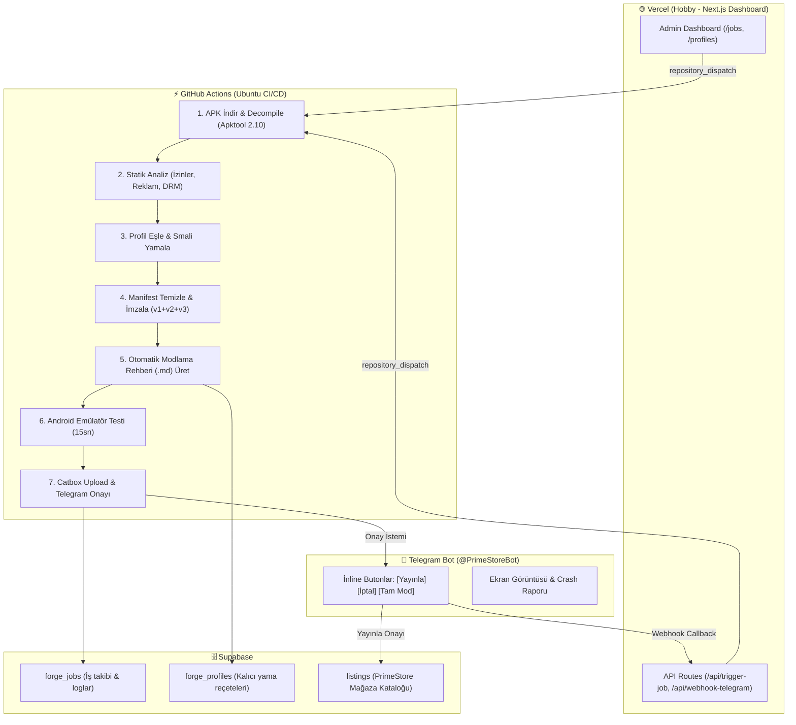

# 🔧 PrimeForge

> PrimeStore için Sunucu Taraflı Otomatik APK Modlama, Test & Dağıtım Motoru (CI/CD Pipeline)

PrimeForge; APK dosyalarını GitHub Actions sunucularında decompile eden, statik analizini gerçekleştiren, profil tabanlı smali yamalarını ve manifest izin temizliğini uygulayan, Android emülatörde 15 saniye çökme testi yapan, modlama rehberini otomatik üretip bir sonraki güncellemeler için reçeteyi kaydeden ve Telegram inline butonlarıyla onaylanan tam entegre bir sistemdir.

---

## 🏗️ Mimari ve Bileşenler



---

## 🌟 Önemli Özellikler

1. **Otomatik Modlama Rehberi Üretimi:**
   - Her modlanan uygulama sonrası `docs/guides/<paket_adi>.md` ve `output/guide.md` dosyası oluşturulur.
   - Uygulanan tüm smali yamaları, kaldırılan izinler, tespit edilen reklam/DRM ağları ve test sonuçları dokümante edilir.

2. **Gelecek Güncellemeler İçin Kalıcı Reçete Kaydı:**
   - Modlama adımları `profiles/<paket_adi>.yml` ve Supabase `forge_profiles` tablosuna `auto_apply: true` ile kaydedilir.
   - Uygulama mağazada veya geliştiricide güncellendiğinde, sistem otomatik olarak bu profili tanır ve aynı yamaları yeni APK'ya uygulayarak sıfır eforla günceller.

3. **Telegram İnline Buton Desteği:**
   - Bot emülatör ekran görüntüsüyle birlikte `[🚀 Supabase'e Yayınla]` ve `[❌ İptal]` butonları gönderir.
   - Bilinmeyen uygulamalarda `[✅ Otomatik Modla]`, `[🧹 İzin Temizle]` seçenekleri sunar.

4. **Vercel Hobby Dashboard:**
   - Next.js tabanlı modern admin arayüzü ile tüm işleri, emülatör durumlarını ve yama profillerini canlı izleme imkanı.

---

## 🚀 Telegram Bot Komutları

| Komut | Açıklama |
|:---|:---|
| `/mod <APK_URL>` | APK'yı tam modlama pipeline'ına gönderir |
| `/analyze <APK_URL>` | Yalnızca statik analiz yapar ve Telegram'a rapor sunar |
| `/sanitize <APK_URL>` | Yalnızca izinleri temizler, reklam kimliğini kaldırır ve imzalar |
| `/status` | Aktif ve bekleyen işlerin durumunu sorgular |
| `/profiles` | Kayıtlı uygulama yama profillerini listeler |

---

## 📂 Dizin Yapısı

```
PrimeForge/
├── .github/workflows/
│   ├── patch-and-test.yml          # Ana CI/CD modlama ve emülatör pipeline'ı
│   ├── publish-approved.yml        # Telegram onayı sonrası yayınlama
│   └── scheduled-update-check.yml  # 6 saatte bir periyodik güncelleme denetimi
├── engine/
│   ├── analyzer.py                 # Statik APK ve güvenlik analiz motoru
│   ├── sanitizer.py                # Manifest izin ve izleyici temizleyici
│   ├── patcher.py                  # Profil tabanlı smali yamalama motoru
│   ├── signer.py                   # Zipalign ve apksigner otomasyonu
│   ├── uploader.py                 # Catbox CDN yükleyici
│   ├── supabase_client.py          # Supabase REST istemcisi
│   ├── guide_recorder.py           # Otomatik rehber & profil kaydedici
│   └── forge_runner.py             # Ana pipeline orkestratörü
├── profiles/
│   ├── _base.yml                   # Ortak sanitasyon kuralları
│   ├── com.metawave.xtreamiptv.yml # Xtiva IPTV Pro Mod profili
│   ├── com.example.vivox.yml       # VivoX Mod profili
│   ├── com.medya.warstv.yml        # WarsTV Mod profili
│   └── _unknown.yml                # Bilinmeyen uygulama şablonu
├── telegram/
│   ├── bot.py                      # Bildirim ve inline buton yönetimi
│   └── webhook_handler.py          # Telegram webhook callback handler
├── app/                            # Vercel Next.js 14 Dashboard (App Router)
│   ├── layout.tsx                  # Glassmorphism tema & navbar
│   ├── page.tsx                    # Ana kontrol paneli & hızlı form
│   ├── jobs/page.tsx               # Tüm işlerin kuyruk listesi
│   ├── profiles/page.tsx           # Mod profilleri ve rehber inceleyici
│   └── api/                        # trigger-job, webhook-telegram, job-status, profiles
├── lib/                            # Supabase client
├── package.json                    # Next.js bağımlılıkları (Zero-config Vercel)
└── requirements.txt                # Python bağımlılıkları (pyyaml, requests)
```

---

## 🔒 Yapılandırılan GitHub Secrets

Repo: `simurgulgen/PrimeForge`
- `SUPABASE_URL`: Supabase proje bağlantı adresi
- `SUPABASE_SERVICE_ROLE_KEY`: Supabase veritabanı yönetim anahtarı
- `TELEGRAM_BOT_TOKEN`: Telegram bot erişim belirteci
- `TELEGRAM_CHAT_ID`: Yönetici Telegram sohbet kimliği
- `KEYSTORE_BASE64`: `primestore_release.jks` imzalama anahtarı (Base64)
- `KEYSTORE_PASSWORD`: `primestore123`
- `KEYSTORE_ALIAS`: `primestore`

---

## ☁️ Vercel Kurulumu (Zero-Config)

1. [Vercel](https://vercel.com) paneline GitHub (`simurgulgen`) ile giriş yap.
2. **Add New Project** → `PrimeForge` reposunu seç.
3. Framework Preset: **Next.js** (Root Directory: varsayılan `.` olarak kalır, hiçbir ayar gerekmez).
4. Environment Variables ekle:
   - `SUPABASE_URL`
   - `SUPABASE_SERVICE_ROLE_KEY`
   - `TELEGRAM_BOT_TOKEN`
   - `TELEGRAM_CHAT_ID`
   - `GITHUB_TOKEN` (Repo dispatch yetkili Personal Access Token)
5. **Deploy** butonuna tıkla. Otomatik derlenecek ve canlıya alınacaktır.
